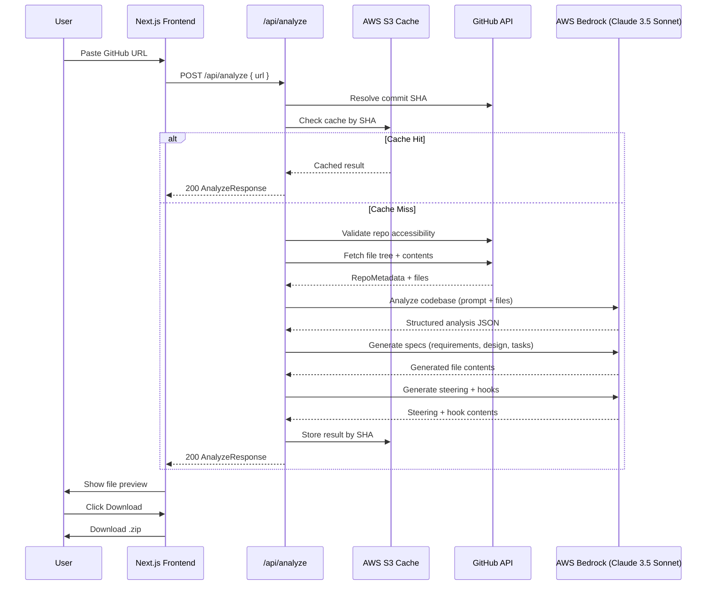
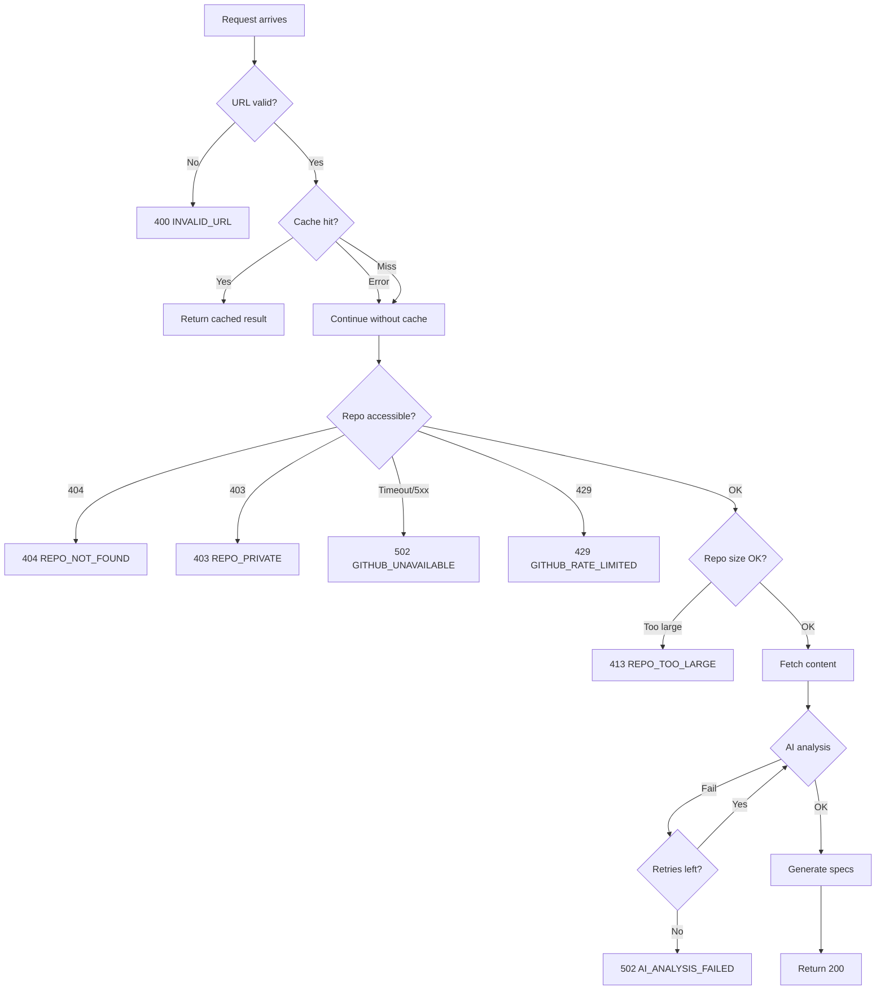

# Design Document: Repository Analysis & Spec Generation

## Overview

SpecForge's core feature accepts a public GitHub repository URL, fetches and analyzes its contents using AI, and generates a complete `.kiro/` folder with specs, steering documents, and hook suggestions. The system is designed as a serverless pipeline: a Next.js frontend collects the URL, a single API route orchestrates the multi-step analysis, and the result is previewed in-browser before being downloaded as a ZIP archive.

The architecture prioritizes simplicity (single API endpoint), security (all secrets server-side), and speed (caching by commit SHA, intelligent file selection to stay within token budgets). The entire flow targets completion within 90 seconds for typical repositories.

## Architecture



### Key Architectural Decisions

| Decision | Rationale |
|----------|-----------|
| Single POST endpoint (`/api/analyze`) | Simplifies client logic; Vercel serverless functions support up to 300s execution |
| Server-Sent Events for progress | Real-time phase updates without polling overhead; fallback to polling if SSE unavailable |
| S3 cache keyed by commit SHA | Deterministic cache invalidation — new commits automatically trigger fresh analysis |
| Sequential Bedrock calls (not parallel) | Each generation step depends on the analysis result; sequential keeps token context coherent |
| Client-side ZIP generation | Avoids server memory pressure; JSZip runs in the browser from the response payload |

## Components and Interfaces

### Frontend Components

#### `RepoInput` (`components/RepoInput.tsx`)

URL input form with client-side validation.

```typescript
interface RepoInputProps {
  onSubmit: (url: string) => void;
  isLoading: boolean;
  error?: string;
}
```

- Text input with `maxLength={2048}` and placeholder showing expected format
- Client-side regex validation: `/^https:\/\/github\.com\/[a-zA-Z0-9._-]+\/[a-zA-Z0-9._-]+\/?$/`
- Displays inline error messages for empty input, invalid format, or server errors
- Submit button disabled while `isLoading` is true

#### `SpecPreview` (`components/SpecPreview.tsx`)

Split-pane file browser with tree navigation and content preview.

```typescript
interface SpecPreviewProps {
  files: GeneratedFile[];
  onFileSelect: (path: string) => void;
  selectedFile?: string;
}
```

- Left panel: `FileTree` component showing `.kiro/` hierarchy
- Right panel: `FilePreview` component with markdown rendering + syntax highlighting
- Auto-selects first file on mount
- Supports markdown, TypeScript, and YAML syntax highlighting via `react-syntax-highlighter`

#### `DownloadButton` (`components/DownloadButton.tsx`)

Triggers client-side ZIP generation and browser download.

```typescript
interface DownloadButtonProps {
  files: GeneratedFile[];
  repoName: string;
  disabled: boolean;
}
```

- Disabled until generation is complete
- Uses JSZip to package files into `.kiro/` directory structure
- Triggers download via `URL.createObjectURL` + anchor click
- Shows error toast with retry on ZIP creation failure

#### `ProgressIndicator` (`components/ProgressIndicator.tsx`)

Displays current analysis phase with animated indicator.

```typescript
interface ProgressIndicatorProps {
  phase: ProgressPhase;
  elapsedSeconds: number;
  onCancel: () => void;
}
```

- Renders phase name + animated spinner/progress bar
- Shows timeout warning after 90 seconds with cancel button
- Phases: `validating` → `fetching` → `analyzing` → `generating` → `complete`

### Backend Modules

#### `github.ts` (`lib/github.ts`) — GitHub Fetcher

Handles all GitHub API interactions using Octokit.

```typescript
// Public API
export async function validateRepository(owner: string, repo: string): Promise<RepoValidation>;
export async function fetchRepositoryContent(owner: string, repo: string): Promise<FetchedContent>;
export async function resolveCommitSHA(owner: string, repo: string): Promise<string>;

// Internal types
interface RepoValidation {
  valid: boolean;
  defaultBranch: string;
}

interface FetchedContent {
  metadata: RepoMetadata;
  files: FetchedFile[];
  fileTree: string; // formatted tree string for AI context
  truncated: boolean;
}

interface FetchedFile {
  path: string;
  content: string;
  size: number;
  truncated: boolean;
}
```

**File prioritization algorithm:**
1. README files (README, README.md, README.rst)
2. Package manifests (package.json, requirements.txt, Cargo.toml, etc.)
3. Configuration files (tsconfig.json, .eslintrc, next.config.js, etc.)
4. Main entry points (index.ts, main.py, app.js, server.ts, etc.)
5. Source files by directory depth (shallower first), then alphabetical

**Constraints:** Max 20 files, 50KB per file (truncate), 100KB total cumulative, skip binaries.

#### `bedrock.ts` (`lib/bedrock.ts`) — AI Client

Manages AWS Bedrock interactions with retry logic.

```typescript
// Public API
export async function analyzeRepository(
  fileTree: string,
  fileContents: FetchedFile[]
): Promise<AIAnalysisResult>;

export async function generateContent(
  prompt: string,
  context: string,
  maxTokens: number
): Promise<string>;

// Configuration
const BEDROCK_CONFIG = {
  modelId: 'anthropic.claude-3-5-sonnet-20241022-v2:0',
  region: process.env.AWS_REGION || 'us-east-1',
  maxInputChars: 150_000,
  timeoutMs: 120_000,
  retryDelayMs: 5_000,
  maxRetries: 3,
};
```

**Retry strategy:**
- First failure: retry after 5 seconds
- Subsequent failures: retry up to 2 more times with 3-second delays
- Total max attempts: 4 (1 initial + 3 retries)

#### `prompts.ts` (`lib/prompts.ts`) — Prompt Library

Centralized prompt templates for all AI interactions.

```typescript
export function getAnalysisPrompt(fileTree: string, fileContents: string): string;
export function getRequirementsPrompt(analysis: AIAnalysisResult): string;
export function getDesignPrompt(analysis: AIAnalysisResult): string;
export function getTasksPrompt(analysis: AIAnalysisResult): string;
export function getSteeringPrompt(analysis: AIAnalysisResult, readme: string): string;
export function getHooksPrompt(analysis: AIAnalysisResult): string;
```

Each function returns a complete prompt string. No AI prompts exist outside this file.

#### `spec-generator.ts` (`lib/spec-generator.ts`) — Orchestrator

Coordinates the multi-step generation pipeline.

```typescript
export async function generateSpecs(
  analysis: AIAnalysisResult,
  metadata: RepoMetadata,
  onProgress: (phase: ProgressPhase) => void
): Promise<GeneratedSpec>;
```

**Orchestration flow:**
1. Generate requirements.md (analysis → EARS-format requirements)
2. Generate design.md (analysis → architecture documentation)
3. Generate tasks.md (analysis → improvement backlog)
4. Generate steering docs (analysis + README → product.md, tech.md, structure.md)
5. Generate hooks (analysis → 2-3 hook suggestion files)

Each step calls `bedrock.generateContent()` with the appropriate prompt from `prompts.ts`.

#### `cache.ts` (`lib/cache.ts`) — S3 Cache

Optional caching layer for analyzed repositories.

```typescript
export async function getCachedResult(sha: string): Promise<GeneratedSpec | null>;
export async function setCachedResult(sha: string, result: GeneratedSpec): Promise<void>;
```

- Reads/writes JSON to S3 bucket keyed by commit SHA
- Graceful degradation: cache failures never block the user flow
- Cache hit returns result within 2 seconds

## Data Models

```typescript
// --- Request/Response Types ---

interface AnalyzeRequest {
  url: string; // GitHub repository URL (max 2048 chars)
}

interface AnalyzeResponse {
  success: true;
  metadata: RepoMetadata;
  spec: GeneratedSpec;
  cached: boolean;
  generatedAt: string; // ISO 8601 timestamp
}

interface ErrorResponse {
  success: false;
  error: {
    code: ErrorCode;
    message: string; // User-facing message
    retryable: boolean;
    retryAfter?: string; // ISO 8601 timestamp for rate limits
  };
}

type ErrorCode =
  | 'INVALID_URL'
  | 'REPO_NOT_FOUND'
  | 'REPO_PRIVATE'
  | 'REPO_TOO_LARGE'
  | 'GITHUB_UNAVAILABLE'
  | 'GITHUB_RATE_LIMITED'
  | 'AI_ANALYSIS_FAILED'
  | 'GENERATION_FAILED'
  | 'INTERNAL_ERROR';

// --- Domain Types ---

interface RepoMetadata {
  owner: string;
  repo: string;
  defaultBranch: string;
  commitSha: string;
  description?: string;
  fileCount: number;
  primaryLanguage?: string;
}

interface GeneratedSpec {
  files: GeneratedFile[];
}

interface GeneratedFile {
  path: string;       // e.g. ".kiro/specs/repo-analysis/requirements.md"
  content: string;    // File content (markdown, YAML, etc.)
  type: FileType;
}

type FileType = 'requirements' | 'design' | 'tasks' | 'steering' | 'hook';

// --- AI Analysis Types ---

interface AIAnalysisResult {
  languages: LanguageEntry[];
  frameworks: FrameworkEntry[];
  architecture: ArchitecturePattern[];
  features: FeatureEntry[];
  relationships: ComponentRelationship[];
  entryPoints: EntryPoint[];
}

interface LanguageEntry {
  name: string;
  percentage: number; // estimated % of codebase
}

interface FrameworkEntry {
  name: string;
  role: string; // e.g. "web framework", "ORM", "build tool"
}

interface ArchitecturePattern {
  pattern: string; // e.g. "MVC", "microservices", "monolith"
  evidence: string;
}

interface FeatureEntry {
  name: string;
  description: string;
  components: string[];
}

interface ComponentRelationship {
  source: string;
  target: string;
  type: 'calls' | 'reads_from' | 'writes_to' | 'subscribes_to' | 'depends_on';
}

interface EntryPoint {
  file: string;
  purpose: string;
}

// --- Progress Types ---

type ProgressPhase =
  | 'validating'
  | 'fetching'
  | 'analyzing'
  | 'generating'
  | 'complete';

interface ProgressEvent {
  phase: ProgressPhase;
  timestamp: string; // ISO 8601
  message?: string;
}
```

## API Contract

### `POST /api/analyze`

Accepts a GitHub repository URL and returns the complete generated spec output.

**Request:**

```http
POST /api/analyze
Content-Type: application/json

{
  "url": "https://github.com/owner/repo"
}
```

**Success Response (200):**

```json
{
  "success": true,
  "metadata": {
    "owner": "vercel",
    "repo": "next.js",
    "defaultBranch": "canary",
    "commitSha": "abc123def456",
    "description": "The React Framework",
    "fileCount": 8542,
    "primaryLanguage": "TypeScript"
  },
  "spec": {
    "files": [
      {
        "path": ".kiro/specs/repo-analysis/requirements.md",
        "content": "# Requirements Document\n...",
        "type": "requirements"
      },
      {
        "path": ".kiro/steering/product.md",
        "content": "# Product Context\n...",
        "type": "steering"
      }
    ]
  },
  "cached": false,
  "generatedAt": "2024-12-15T10:30:00.000Z"
}
```

**Error Responses:**

| Status | Code | Condition |
|--------|------|-----------|
| 400 | `INVALID_URL` | URL is empty, malformed, or doesn't match GitHub pattern |
| 404 | `REPO_NOT_FOUND` | Repository doesn't exist on GitHub |
| 403 | `REPO_PRIVATE` | Repository requires authentication |
| 413 | `REPO_TOO_LARGE` | Repository exceeds 10,000 files or 500MB |
| 429 | `GITHUB_RATE_LIMITED` | GitHub API rate limit exceeded |
| 502 | `GITHUB_UNAVAILABLE` | GitHub API timeout or 5xx response |
| 502 | `AI_ANALYSIS_FAILED` | Bedrock failed after all retries |
| 500 | `INTERNAL_ERROR` | Unhandled server error (details logged, not exposed) |

**Error Response Shape:**

```json
{
  "success": false,
  "error": {
    "code": "GITHUB_RATE_LIMITED",
    "message": "GitHub API rate limit exceeded. Resets at 2024-12-15T11:00:00Z.",
    "retryable": true,
    "retryAfter": "2024-12-15T11:00:00.000Z"
  }
}
```

### `GET /api/analyze/progress` (SSE)

Server-Sent Events endpoint for real-time progress updates.

**Request:**

```http
GET /api/analyze/progress?requestId={id}
Accept: text/event-stream
```

**Events:**

```
event: progress
data: {"phase":"fetching","timestamp":"2024-12-15T10:30:05.000Z","message":"Fetching repository files..."}

event: progress
data: {"phase":"analyzing","timestamp":"2024-12-15T10:30:08.000Z","message":"Analyzing codebase with AI..."}

event: complete
data: {"phase":"complete","timestamp":"2024-12-15T10:30:45.000Z"}
```

## AI Prompt Strategy

### 1. Codebase Analysis Prompt

**Context sent to AI:**
- Complete file tree (formatted as indented directory listing, max 10,000 entries)
- Contents of up to 20 prioritized files (max 150,000 chars total)
- Repository metadata (name, description, primary language)

**System prompt approach:**
```
You are a senior software architect analyzing a codebase. Given the file tree and 
selected file contents, produce a structured JSON analysis. Be precise and evidence-based — 
only report what you can directly observe in the code.
```

**Expected output format:**
```json
{
  "languages": [{"name": "TypeScript", "percentage": 75}],
  "frameworks": [{"name": "Next.js", "role": "web framework"}],
  "architecture": [{"pattern": "MVC", "evidence": "separate routes/, models/, views/ dirs"}],
  "features": [{"name": "Auth", "description": "JWT-based authentication", "components": ["lib/auth.ts"]}],
  "relationships": [{"source": "API routes", "target": "Database", "type": "reads_from"}],
  "entryPoints": [{"file": "app/page.tsx", "purpose": "Main application entry"}]
}
```

**Token budget:** ~150K chars input (~37K tokens). Output capped at 4,096 tokens.

### 2. Requirements Generation Prompt

**Context sent to AI:**
- Full `AIAnalysisResult` JSON
- Repository name and description

**System prompt approach:**
```
You are a requirements engineer. Given the codebase analysis, generate a requirements.md 
following EARS syntax (Easy Approach to Requirements Syntax). Every acceptance criterion 
must use exactly one EARS pattern: Ubiquitous, Event-driven, State-driven, Unwanted event, 
Optional feature, or Complex.
```

**Expected output format:** Raw markdown string — complete `requirements.md` content with Glossary, numbered requirements, user stories, and acceptance criteria.

**Token budget:** ~8K tokens input (analysis JSON). Output capped at 8,192 tokens.

### 3. Design Generation Prompt

**Context sent to AI:**
- Full `AIAnalysisResult` JSON
- Generated requirements summary (feature names + component list)

**System prompt approach:**
```
You are a software architect. Given the codebase analysis, generate a design.md documenting 
the system's architecture. Include: architecture overview (2+ sentences), tech stack with 
roles, component descriptions, and data flow between components.
```

**Expected output format:** Raw markdown string — complete `design.md` with sections for architecture overview, tech stack, components, and data flow.

**Token budget:** ~10K tokens input. Output capped at 6,144 tokens.

### 4. Tasks Generation Prompt

**Context sent to AI:**
- Full `AIAnalysisResult` JSON
- List of detected testing gaps, documentation state, code quality signals

**System prompt approach:**
```
You are a tech lead reviewing a codebase for improvement opportunities. Generate 5-50 
actionable tasks as markdown checkboxes, organized under category headings. Categories: 
testing gaps, documentation improvements, refactoring opportunities, feature enhancements. 
Each task must identify a specific file/component and action.
```

**Expected output format:** Raw markdown string — complete `tasks.md` with h2 category headings and checkbox items.

**Token budget:** ~8K tokens input. Output capped at 4,096 tokens.

### 5. Steering Documents Prompt

**Context sent to AI:**
- Full `AIAnalysisResult` JSON
- README content (if available)
- File tree structure

**System prompt approach:**
```
You are a developer advocate creating project context documents. Generate three steering 
files: product.md (purpose, users, value prop), tech.md (stack, conventions, principles), 
and structure.md (directory layout, naming, organization). Base product.md primarily on 
the README; base tech.md and structure.md on the code analysis.
```

**Expected output format:** JSON with three keys (`product`, `tech`, `structure`), each containing the raw markdown content for that file.

**Token budget:** ~12K tokens input. Output capped at 6,144 tokens.

### 6. Hook Suggestions Prompt

**Context sent to AI:**
- Detected languages and frameworks from analysis
- Project type classification

**System prompt approach:**
```
You are a DevOps engineer suggesting automation hooks. Based on the detected tech stack, 
suggest 2-3 Kiro hooks. Each hook needs: event type (max 50 chars), action (max 200 chars), 
and description (max 300 chars). Map to known patterns: JS→lint-on-save, TS→type-check, 
test framework→test-runner.
```

**Expected output format:** JSON array of hook objects with `eventType`, `action`, and `description` fields.

**Token budget:** ~2K tokens input. Output capped at 2,048 tokens.

### Token Budget Summary

| Step | Input Budget | Output Cap | Estimated Time |
|------|-------------|------------|----------------|
| Analysis | 150K chars (~37K tokens) | 4,096 tokens | 15-30s |
| Requirements | ~8K tokens | 8,192 tokens | 10-20s |
| Design | ~10K tokens | 6,144 tokens | 10-20s |
| Tasks | ~8K tokens | 4,096 tokens | 8-15s |
| Steering | ~12K tokens | 6,144 tokens | 10-20s |
| Hooks | ~2K tokens | 2,048 tokens | 5-10s |
| **Total** | — | — | **58-115s** |

## Error Handling

### Error Categories and Strategies

| Error Type | Detection | Response | Recovery |
|-----------|-----------|----------|----------|
| **Invalid URL** | Client-side regex + server validation | 400 with format hint | User corrects input |
| **Repo not found** | GitHub API 404 | 404 with clear message | User checks URL |
| **Repo private** | GitHub API 403 (no rate limit headers) | 403 explaining public-only | User uses public repo |
| **Rate limited** | GitHub API 403 + `x-ratelimit-remaining: 0` | 429 with reset timestamp | User waits or uses token |
| **GitHub down** | GitHub API timeout (10s) or 5xx | 502 with retry suggestion | Auto-retry not attempted for GitHub |
| **AI timeout** | Bedrock 120s timeout | Retry up to 3 times | Exponential backoff (5s, 3s, 3s) |
| **AI invalid response** | JSON parse failure or missing fields | Treat as AI failure, retry | Same retry logic |
| **Oversized repo** | File tree > 10,000 entries | 413 with size message | User tries smaller repo |
| **Cache unavailable** | S3 read/write timeout or error | Proceed without cache | Silent degradation, log error |
| **ZIP creation failure** | JSZip throws in browser | Error toast + retry button | User clicks retry |

### Error Response Flow



### Security Considerations

- GitHub token never exposed to client (server-side only)
- AWS credentials never in response payloads
- Error messages sanitized: no stack traces, internal paths, or dependency names in client responses
- All errors logged server-side with full context for debugging
- Input URL sanitized before use in API calls (prevent SSRF via URL manipulation)

## Testing Strategy

### Unit Tests

- **URL validation**: Valid GitHub URLs, invalid formats, edge cases (trailing slashes, extra segments, special characters in owner/repo)
- **File prioritization**: Correct ordering by priority tier, depth, and alphabetical within tier
- **Content truncation**: Files exceeding 50KB truncated correctly, cumulative 100KB limit enforced
- **ZIP filename sanitization**: Special characters replaced, length truncated to 100 chars
- **AI response validation**: Valid JSON with all 6 sections, partial responses rejected, malformed JSON handled
- **Error code mapping**: GitHub status codes mapped to correct ErrorCode values
- **Rate limit parsing**: `x-ratelimit-reset` header parsed to ISO timestamp

### Integration Tests

- **Happy path**: Mock GitHub + Bedrock, verify full pipeline produces valid AnalyzeResponse
- **Cache hit**: Verify cached result returned without Bedrock calls
- **GitHub errors**: Verify correct HTTP status codes for 404, 403, 429, 5xx scenarios
- **AI retry logic**: Verify retry behavior on first failure, eventual success, and exhausted retries
- **Progress events**: Verify SSE emits correct phase transitions in order

### Property-Based Tests

Property-based testing applies to the pure transformation logic in this feature:
- URL parsing and validation (input space: arbitrary strings)
- File prioritization sorting (input space: arbitrary file lists)
- Content size enforcement (input space: files of varying sizes)
- Filename sanitization (input space: arbitrary strings)
- AI response validation (input space: arbitrary JSON structures)

See Correctness Properties section below for formal property definitions.


## Performance Considerations

### Target: Total Response Under 90 Seconds

The 90-second budget is the primary constraint. Here's how each phase is budgeted and optimized:

```mermaid
gantt
    title Time Budget Allocation (90s target)
    dateFormat s
    axisFormat %S s

    section Validation
    URL validation + SHA resolve : 0, 3s
    Cache check                  : 3, 2s

    section Fetching
    Repo validation              : 5, 3s
    File tree + content fetch    : 8, 7s

    section AI Calls
    Codebase analysis            : 15, 25s
    Requirements generation      : 40, 15s
    Design generation            : 55, 12s
    Tasks generation             : 67, 10s
    Steering + hooks             : 77, 13s
```



### Optimization Strategies

| Strategy | Impact | Implementation |
|----------|--------|----------------|
| **Cache by commit SHA** | Eliminates AI calls entirely on repeat visits | S3 lookup < 2s; cache hit returns immediately |
| **Aggressive file limits** | Keeps AI input small → faster responses | 20 files, 100KB total, 150K char payload cap |
| **Sequential AI calls with minimal context** | Each call gets only what it needs | Analysis gets files; generation gets analysis JSON only |
| **Client-side ZIP** | Zero server time for packaging | JSZip runs in browser after response arrives |
| **Early termination** | Fail fast on invalid inputs | URL validation + repo check complete in < 5s |
| **Parallel GitHub calls** | Reduce fetch phase | Tree + README fetched concurrently where possible |

### Timeout Cascade

Each phase has its own timeout to prevent one slow step from consuming the entire budget:

| Phase | Timeout | Fallback |
|-------|---------|----------|
| GitHub SHA resolve | 10s | Return error immediately |
| S3 cache read | 5s | Skip cache, proceed fresh |
| GitHub repo validation | 10s | Return 502 |
| GitHub content fetch | 15s | Return with partial files |
| Bedrock analysis | 120s | Retry once (5s delay) |
| Bedrock generation (each) | 60s | Retry once (3s delay) |
| S3 cache write | 10s | Skip silently, return result |

### Worst-Case vs Typical Timing

- **Cache hit**: ~2-3 seconds (SHA resolve + S3 read)
- **Typical fresh analysis**: 50-70 seconds (small-medium repos)
- **Worst case (large repo, slow AI)**: 90-115 seconds (triggers timeout warning at 90s)
- **With retry**: Up to 140 seconds (user sees cancel option at 90s)

### Vercel Function Limits

- **Max execution time**: 300s (Pro plan) / 60s (Hobby plan)
- **Max response size**: 4.5MB (sufficient for generated specs)
- **Memory**: 1024MB default (sufficient for JSON processing)
- **Recommendation**: Deploy on Pro plan to accommodate AI retry scenarios

## Correctness Properties

*A property is a characteristic or behavior that should hold true across all valid executions of a system — essentially, a formal statement about what the system should do. Properties serve as the bridge between human-readable specifications and machine-verifiable correctness guarantees.*

### Property 1: URL validation classifies correctly

*For any* string, the URL validator SHALL accept it if and only if it matches the pattern `https://github.com/{owner}/{repo}` where owner and repo contain only valid GitHub characters (`a-zA-Z0-9._-`), and SHALL reject all other strings.

**Validates: Requirements 1.2, 1.4**

### Property 2: File selection never exceeds maximum count

*For any* repository file tree of any size, the file selection algorithm SHALL return at most 20 files, not counting skipped binary files toward the limit.

**Validates: Requirements 3.3**

### Property 3: File selection respects priority ordering

*For any* set of fetchable files, the output list SHALL be ordered such that: README files appear before package manifests, package manifests before configuration files, configuration files before entry points, entry points before source files, and within the same priority tier, shallower files appear before deeper files, with alphabetical ordering as the final tiebreaker.

**Validates: Requirements 3.4**

### Property 4: Single file truncation at size boundary

*For any* file with content exceeding 50KB, the fetched content SHALL be exactly 50KB (51,200 bytes) followed by a truncation notice, and for any file at or below 50KB, the content SHALL be returned unmodified.

**Validates: Requirements 3.5**

### Property 5: Cumulative content respects size limit

*For any* set of fetched files, the sum of all file content sizes in the result SHALL not exceed 100KB (102,400 bytes), and files SHALL be included in priority order until the limit would be exceeded.

**Validates: Requirements 3.6**

### Property 6: Binary files excluded from results

*For any* repository file tree containing binary files (images, compiled artifacts, fonts, archives), no binary file SHALL appear in the fetched file results, regardless of its priority tier or position in the tree.

**Validates: Requirements 3.8**

### Property 7: AI payload respects character limit

*For any* combination of file tree string and fetched file contents, the assembled payload sent to Bedrock SHALL not exceed 150,000 characters total (file tree + file contents + prompt template).

**Validates: Requirements 4.1**

### Property 8: AI response validation accepts only complete responses

*For any* JSON object, the AI response validator SHALL accept it if and only if it contains all six required sections (languages, frameworks, architecture, features, relationships, entryPoints) each as a non-empty array, and SHALL reject any response that is not valid JSON or is missing any section.

**Validates: Requirements 4.6, 4.7**

### Property 9: ZIP filename sanitization produces valid names

*For any* repository name string, the sanitized filename SHALL contain only characters matching `[a-zA-Z0-9_-]`, SHALL be at most 100 characters long, and SHALL end with `-kiro-specs.zip`. The sanitization SHALL be idempotent: sanitizing an already-sanitized name produces the same result.

**Validates: Requirements 11.3**
